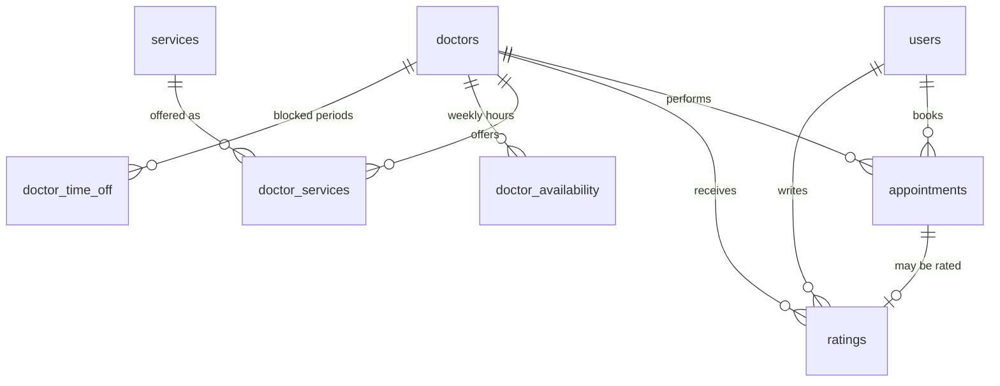

# Doctor Appointment Booking — Backend

A modular monolith in Java 21 / Spring Boot for booking doctor appointments:
patients book a service with a doctor, the doctor approves and later completes
or marks a no-show, the patient rates the visit, staff manages the catalogue
and the doctors. PostgreSQL + Flyway + JPA/Hibernate, hand-rolled HS256 JWT auth
(no OAuth2 libraries), Docker Compose for one-command startup.

## What it does

* **Booking with real rules.** A booking is only accepted if the doctor offers
  that service, the slot is in the future and falls inside his weekly working
  hours, and it does not collide with an existing appointment.
* **Full appointment lifecycle.** `SCHEDULED → CONFIRMED → COMPLETED`, plus
  cancellation, rescheduling and no-show, each with its own guard rules.
* **Double booking is impossible at the database level**, not just in Java —
  a GiST exclusion constraint rejects overlapping appointments for one doctor,
  and `@Version` guards concurrent status changes.
* **Doctors own their schedule.** Weekly working hours and time-off, which
  booking immediately respects.
* **Ratings** only from the patient of a completed visit, one per appointment.

## Database schema

Ten tables. Flyway owns every one of them; Hibernate only validates the result.



| table | purpose | notable columns / constraints |
|---|---|---|
| `users` | patients and staff | `role` ∈ `PATIENT`,`ADMIN`; unique index on `LOWER(email)` |
| `doctors` | doctor accounts, separate login table | unique index on `LOWER(email)`; has its own `password_hash` |
| `services` | the bookable catalogue | `duration_minutes > 0`, `price >= 0`, unique `name` |
| `doctor_services` | which doctor offers which service | composite PK `(doctor_id, service_id)`, `ON DELETE CASCADE` both sides |
| `appointments` | the booking core | `start_time`/`end_time`, `status` CHECK, `version` for optimistic locking |
| `ratings` | one rating per visit | `score` 1–5 CHECK, `UNIQUE (user_id, appointment_id)` |
| `doctor_availability` | weekly working hours | `day_of_week` 1–7 (Mon–Sun), `end_time > start_time` CHECK |
| `doctor_time_off` | holidays, sick leave | `end_at > start_at` CHECK |
| `refresh_tokens` | hashed, rotated refresh tokens | `token_hash` SHA-256, `revoked_at` set on logout |
| `flyway_schema_history` | Flyway's own bookkeeping | — |

**Why patients and doctors are two tables.** They share an identity concept
(e-mail, password hash, roles) but doctors carry a `specialization` and own
availability and appointments. Keeping them apart means the doctor catalogue is
not polluted with patients. The cost is that one SQL unique index cannot span
both tables, so cross-table e-mail uniqueness is enforced in `UserService`
(`assertEmailAvailable`).

**What the database guarantees that Java does not:**

```sql
-- one doctor can never hold two overlapping appointments, whatever the
-- application does and however many instances race each other
ALTER TABLE appointments ADD CONSTRAINT ex_appointments_no_doctor_overlap
    EXCLUDE USING gist (
        doctor_id WITH =,
        tstzrange(start_time, end_time) WITH &&
    ) WHERE (status IN ('SCHEDULED', 'CONFIRMED'));
```

Cancelling or completing frees the slot again, because the constraint only
covers the two blocking statuses.

## How a request flows

Read the code top-down along this path; every step maps to exactly one file.

```
  HTTP request
     │
     │ 1. SecurityConfig            which routes are public, which need a token
     │ 2. JwtAuthenticationFilter   Authorization: Bearer … → AppUserPrincipal
     │                              (rejects deleted accounts' tokens; else 401)
     │ 3. Controller                @Valid on the body, @PreAuthorize for the role
     │ 4. Service                   business rules + @Transactional boundary
     │ 5. Repository                Spring Data JPA, derived queries
     │ 6. PostgreSQL                constraints enforce what slipped through
     │
     └─ any exception → ApiExceptionHandler → RFC 7807 problem detail
```

| # | layer | file | what it decides |
|---|---|---|---|
| 1 | security config | `config/SecurityConfig` | public vs authenticated routes, role requirements |
| 2 | token filter | `security/JwtAuthenticationFilter` | who the caller is, from the token alone — no DB hit per request |
| 3 | web | `<module>/…Controller` | shape validation (`400`), coarse role checks (`@PreAuthorize`) |
| 4 | domain | `<module>/…Service` | the real rules: availability, overlaps, status transitions |
| 5 | data | `<module>/…Repository` | queries, by naming convention rather than JPQL |
| 6 | database | `db/migration/V*.sql` | the invariants that hold no matter what |

**Where to start reading.** Every controller opens with a Javadoc block listing
its sibling endpoints, so pick an endpoint there and follow one request DTO and
one service method. `AppointmentService.book` is the densest example: it checks
that the doctor offers the service, that the slot is in the future, that it fits
the weekly schedule and no time-off — then lets the database reject an overlap.

**Worked example — `POST /api/appointments`**

```
controller   @PreAuthorize("hasRole('USER')") + @Valid BookAppointmentRequest
service      AppointmentService.book(principal, request)
               ├─ service exists and is offered by the doctor → 404 / 400
               ├─ startTime must be in the future              → 400
               ├─ endTime = startTime + service.durationMinutes
               ├─ DoctorAvailabilityService.isAvailable(...)    → 400
               └─ INSERT                                         → 409 on overlap
response     201 with AppointmentResponse (associations as ids, never entities)
```

## Quick start

```bash
cp .env.example .env       # adjust if you like; defaults work locally
docker compose up --build  # app on :8080, postgres on :5432
```

Flyway migrates the schema on startup and Hibernate validates it
(`ddl-auto=validate`; Hibernate never creates tables).

The first start creates a bootstrap ADMIN account so you can sign in:

| account                          | password     | role  |
|----------------------------------|--------------|-------|
| `admin@doctor-appointment.local` | `Admin12345` | ADMIN |

Configure or disable it via `BOOTSTRAP_ADMIN_EMAIL` / `BOOTSTRAP_ADMIN_PASSWORD`.

### Local development without Docker for the app

```bash
docker compose up -d db           # only postgres
DB_PASSWORD=doctor ./mvnw spring-boot:run
```

### Tests

```bash
./mvnw test
```

Integration tests run against a real PostgreSQL started by Testcontainers and
are skipped automatically when no Docker daemon is available.

## Architecture

```
app (Spring Boot, Java 21)          db (PostgreSQL 17)
├─ users        (patients + staff)  ├─ users
├─ doctors      (doctor accounts)   ├─ doctors
├─ services     (catalogue)         ├─ services
├─ doctorservices (join entity)     ├─ doctor_services  PK (doctor_id, service_id)
├─ appointments (booking core)      ├─ appointments    EXCLUDE gist (no overlap)
├─ ratings      (doctor feedback)   ├─ ratings         UNIQUE (user_id, appointment_id)
├─ auth         (JWT login/refresh) ├─ refresh_tokens  (hashed)
├─ security     (JWT, principal)    ├─ doctor_availability
├─ config       (wiring, errors)    ├─ doctor_time_off
└─ common       (shared DTO/error)  └─ flyway_schema_history
```

Package-by-feature: every module keeps its entity, repository, service,
controller and DTOs together. Migrations are the single source of truth
(`src/main/resources/db/migration/V1…V4`).

### Decisions worth explaining

| Decision | Why |
|---|---|
| Hand-rolled HS256 JWT instead of Spring Security OAuth2 | Keeps the token format and the rotation rules visible in one small class; no dependency to configure around. |
| Refresh tokens stored hashed | Logout really revokes a token, instead of merely asking the client to forget it. |
| Double booking enforced in the database | An exclusion constraint holds even if two app instances race or someone bypasses the service layer. |
| Flyway owns the schema, Hibernate only validates | `ddl-auto=validate` makes an accidental schema change a startup failure, not a silent one. |
| A `Clock` bean for all "now" comparisons | Time-dependent rules (has the appointment ended? is the cancellation late?) are testable in milliseconds instead of by waiting hours. |
| Cross-table e-mail check in the service | Patients and doctors live in two tables; a SQL unique index cannot span both, so the check is explicit. |

## Authentication

Three account types: **PATIENT** (`ROLE_USER`), **DOCTOR** (`ROLE_DOCTOR`) and
**ADMIN** (`ROLE_ADMIN`, a `users` row with `role=ADMIN`).

* Access token: short-lived JWT in `Authorization: Bearer …`
* Refresh token: long-lived, rotated on every refresh, stored hashed so that
  logout revokes it
* Deleting an account immediately invalidates its outstanding access tokens
* E-mails are stored lower-case; a unique index on `LOWER(email)` plus a
  cross-table check keep them unique case-insensitively

```bash
# register (patient) and log in
curl -X POST localhost:8080/api/auth/register -H 'Content-Type: application/json' \
  -d '{"firstName":"Alan","lastName":"Turing","email":"alan@example.org","password":"Enigma123"}'
curl -X POST localhost:8080/api/auth/login -H 'Content-Type: application/json' \
  -d '{"email":"alan@example.org","password":"Enigma123"}'
# -> { accessToken, refreshToken, tokenType, expiresIn, accountId, email, accountType }

curl localhost:8080/api/appointments/me -H "Authorization: Bearer $ACCESS_TOKEN"
```

| method | path                    | public? | description                       |
|--------|-------------------------|---------|-----------------------------------|
| POST   | `/api/auth/register`    | yes     | patient self registration         |
| POST   | `/api/auth/login`       | yes     | e-mail + password → token pair    |
| POST   | `/api/auth/refresh`     | yes     | new pair, old refresh is revoked  |
| POST   | `/api/auth/logout`      | yes     | revokes the refresh token         |
| GET    | `/api/auth/me`          | token   | who am I                          |

## Endpoints

### Appointments

A doctor only ever sees his own; a patient only his own bookings.

| method | path                            | who            | description                        |
|--------|---------------------------------|----------------|------------------------------------|
| POST   | `/api/appointments`             | patient        | book (availability rules apply)    |
| GET    | `/api/appointments/me`          | any account    | own appointments                   |
| GET    | `/api/appointments/me/pending`  | doctor         | own `SCHEDULED` appointments       |
| GET    | `/api/appointments/me/approved` | doctor         | own `CONFIRMED` appointments       |
| GET    | `/api/appointments/{id}`        | parties only   | one appointment                    |
| POST   | `/api/appointments/{id}/approve`| owning doctor  | `SCHEDULED` → `CONFIRMED`          |
| POST   | `/api/appointments/{id}/cancel` | parties/ADMIN  | → `CANCELLED` (`NO_SHOW` if a patient is under 24h) |
| POST   | `/api/appointments/{id}/reschedule` | parties/ADMIN | new time, back to `SCHEDULED`      |
| POST   | `/api/appointments/{id}/complete`| owning doctor  | `CONFIRMED` → `COMPLETED`, once ended |
| POST   | `/api/appointments/{id}/no-show`| doctor/ADMIN   | `CONFIRMED` → `NO_SHOW`, once ended |

### Doctor availability and time-off (doctor or ADMIN)

| method | path                                | description                     |
|--------|-------------------------------------|---------------------------------|
| GET    | `/api/doctors/me/availability`      | own weekly schedule             |
| POST   | `/api/doctors/me/availability`      | add a slot (1 = Mon … 7 = Sun)  |
| DELETE | `/api/doctors/me/availability/{id}` | remove a slot                   |
| GET    | `/api/doctors/me/time-off`          | own blocked periods             |
| POST   | `/api/doctors/me/time-off`          | add a blocked period            |
| DELETE | `/api/doctors/me/time-off/{id}`     | remove a blocked period         |

### Doctors, services and ratings

| method | path                                    | who       |
|--------|-----------------------------------------|-----------|
| GET    | `/api/doctors`, `/api/doctors/{id}`     | public    |
| GET    | `/api/doctors/me`                       | doctor    |
| PUT    | `/api/doctors/me/password`              | doctor    |
| POST   | `/api/doctors`                          | ADMIN     |
| PUT    | `/api/doctors/{id}`                     | self/ADMIN |
| DELETE | `/api/doctors/{id}`                     | ADMIN     |
| POST   | `/api/doctors/{id}/services/{sid}`      | ADMIN     |
| DELETE | `/api/doctors/{id}/services/{sid}`      | ADMIN     |
| GET    | `/api/services`, `/api/services/{id}`   | public    |
| POST/PUT/DELETE | `/api/services[/{id}]`         | ADMIN     |
| GET    | `/api/ratings`, `/api/ratings/{id}`     | public    |
| GET    | `/api/ratings/doctor/{id}`              | public    |
| GET    | `/api/ratings/doctor/{id}/average`      | public    |
| POST   | `/api/ratings`                          | patient (completed visit only) |

### Users

| method         | path                    | who         |
|----------------|-------------------------|-------------|
| GET            | `/api/users/me`         | patient/ADMIN |
| PUT            | `/api/users/me`         | patient/ADMIN |
| PUT            | `/api/users/me/password`| patient/ADMIN |
| DELETE         | `/api/users/me`         | patient/ADMIN |
| POST           | `/api/users`            | ADMIN       |
| GET            | `/api/users`            | ADMIN       |
| GET/PUT/DELETE | `/api/users/{id}`       | self or ADMIN |

Errors are RFC 7807 problem details: `400` validation or a violated business
rule, `401` missing/invalid token or credentials, `403` wrong role or owner,
`404` missing resource, `409` duplicate e-mail, illegal status change, or a
delete that still has dependants.

## Configuration

All environment variables live in `.env.example` (copy to `.env`):

* `DB_HOST`, `DB_PORT`, `DB_NAME`, `DB_USERNAME`, `DB_PASSWORD`
* `JWT_SECRET` (≥ 32 bytes), `JWT_ACCESS_TOKEN_TTL`, `JWT_REFRESH_TOKEN_TTL`
* `BOOTSTRAP_ADMIN_EMAIL`, `BOOTSTRAP_ADMIN_PASSWORD`
* `APP_PORT`, `SERVER_PORT`

## Known limitations

* Weekly availability is evaluated in one clinic-wide time zone (the clock's
  zone); a per-doctor zone is not modelled yet.
* No pagination or filtering on the list endpoints — the data sets are small.
* `DeletedAccountRegistry` keeps deleted accounts in memory, so a restart clears
  it and a multi-instance deployment would not see a deletion immediately.